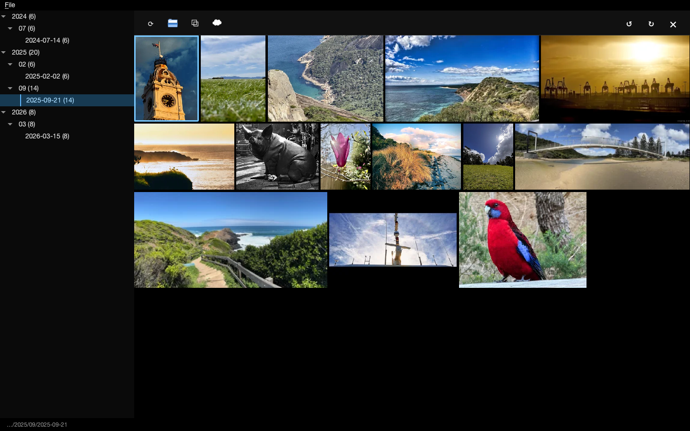
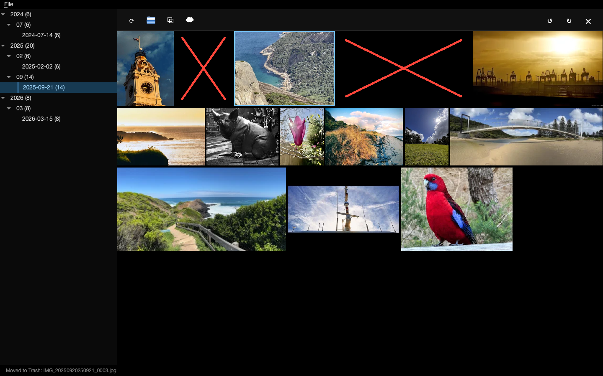
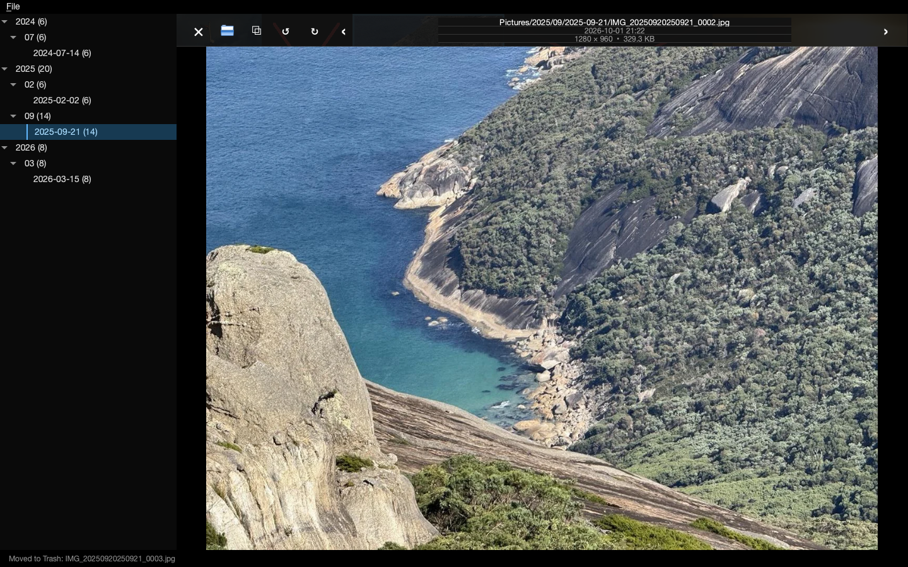
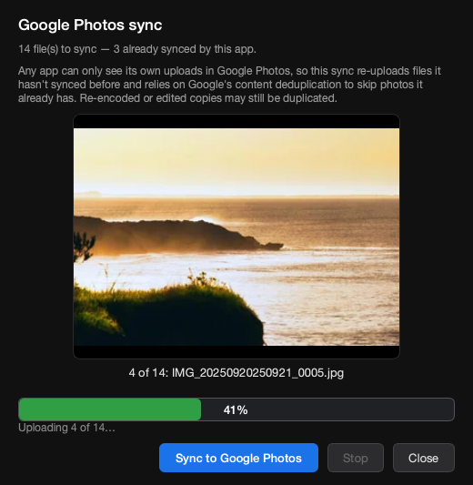

# tomsphotos

A minimal, fast desktop photo browser for macOS, built with PySide6 (Qt 6).

It organizes a photo library by directory (e.g. `~/Pictures`), shows a
Google-Photos-style justified grid, and opens full-size photo/video detail
views. Built to handle large libraries (tens of thousands of files) without
lag: thumbnails are generated in a background worker pool, cached in SQLite,
and the grid only renders what's on screen.

## Screenshots

Justified gallery with the directory tree on the left:



Photos marked for deletion (red cross, moved to the macOS Trash):



Full-size detail view (path, date, resolution and size in the toolbar):



Google Photos sync dialog:



_Sample photos live in `scripts/sample_photos/`. Regenerate the screenshots with
`python scripts/make_screenshots.py` (headless)._

## Features

- **Directory tree** — left panel shows your photo library's folder structure
  (years/months/days or any layout). Media counts come from a background scan.
- **Justified gallery** — virtualized grid with smooth scrolling; only visible
  thumbnails are decoded and painted.
- **Full-size detail view** — click any photo or video to view it full-size.
  Photo/video navigation with `←` / `→`.
- **Metadata-only rotation** — rotate photos and videos 90° left/right without
  re-encoding pixels. Writes the EXIF Orientation tag (images) or the video
  Rotation matrix (MOV/MP4) via `exiftool`. Works in both the detail view and
  the thumbnail grid.
- **Copy to clipboard** — copy the current image to the clipboard.
- **Google Photos sync** — ☁ button in the thumbnail toolbar runs a one-way
  sync of the current folder. Since Google's April 2025 API changes no
  third-party app can list your library, so the app skips files it already
  synced (app-owned `tomsphotos` album by filename + a local upload log
  keyed by path/mtime/size), uploads the rest at full resolution, and lets
  Google's content deduplication absorb photos already in the account.
  The dialog shows the file currently uploading as a live thumbnail.
  Re-encoded or edited copies may still be duplicated. One-time OAuth setup
  via `File → Google Photos Setup…` (your own Google Cloud Desktop OAuth
  client).
- **Move to Trash** — delete files safely via the macOS Trash.
- **Configurable photo directory** — `File → Set Photo Directory…` (`⌘O`) to
  point the app at any folder; persisted in `settings.json`.
- **EXIF-aware display** — portrait photos and videos display upright.

## Keyboard shortcuts

| Key | Action |
|-----|--------|
| `←` / `→` | previous / next (detail view) or move selection (grid) |
| `Space` | open selected item |
| `Esc` / `Space` | close detail view |
| `[` / `]` | rotate counter-clockwise / clockwise |
| `X` / `x` | delete to Trash (no confirm / confirm) |
| `⌘O` | choose photo directory |

## How thumbnails are generated

- **Images** — Pillow decodes only the resolution needed (`draft`), applies
  EXIF orientation (`ImageOps.exif_transpose`), downscales with Lanczos, and
  encodes to WebP. HEIC/HEIF falls back to macOS `sips`.
- **Videos** — `ffmpeg` extracts a frame (seeked ~25% in), which is scaled and
  encoded to WebP the same way.
- **Pipeline** — a bounded `QThreadPool` worker pool generates thumbnails by
  priority (visible items first, background preload last). Results are cached
  in a SQLite store (`thumbnails.db`) keyed by path + mtime + size, so
  unchanged files load instantly on the next launch. A separate cache holds
  the full-size (1920px) detail image.
- **Layout** — each item's aspect ratio is probed from the source file header
  (dimensions are orientation-aware) and used to compute the justified rows.

## What it's tested on

- **Platform:** macOS (Apple Silicon), Python 3.11
- **Versions:** PySide6 6.11, Pillow 11.3, exiftool 13.50, ffmpeg 4.2
- **Test mode:** headless via `QT_QPA_PLATFORM=offscreen`
- 51 tests covering the scanner, thumbnail generation & cache, justified
  layout math, gallery hit-testing, GUI integration (tree, gallery, detail
  view, navigation toolbar), metadata rotation, and performance regression
  thresholds (e.g. scanning ~6k files < 2s, 15k-item layout < 1s).

## Installation

Requires macOS with [Homebrew](https://brew.sh).

```bash
# 1. System binaries
brew install ffmpeg exiftool

# 2. Python 3.11+ and dependencies
python3 -m venv .venv
source .venv/bin/activate
pip install -r requirements.txt

# 3. Run
python main.py
```

On first launch the app defaults to `~/Pictures`. Use
`File → Set Photo Directory…` to point it at your library.

### Running the tests

```bash
source .venv/bin/activate
python -m pytest tests/
```

## Project layout

```
config.py        Settings, defaults, persisted photo directory, QSS theme
scanner.py       Directory indexer + SQLite index (media counts per dir)
thumbgen.py      Thumbnail generation (Pillow / ffmpeg) + worker pool
thumbstore.py    SQLite thumbnail cache (grid + full-size)
gallerypanel.py  Virtualized justified gallery grid
fullview.py      Full-size photo/video overlay with toolbar
treepanel.py     Filesystem-backed directory tree
rotate_media.py  Metadata-only rotation via exiftool
gphotos.py       Google Photos OAuth + Library API client (stdlib only)
gpdialog.py      Google Photos sync dialog (live upload progress + thumbnail)
synclog.py       Upload log (SQLite) — source of truth for "already synced"
statusbar.py     Progress / status widgets
main.py          App entry point, window, menus
scripts/         Developer tooling (screenshot generation)
```
